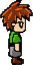

<h1>Platformer Game👉🎮👈</h1>

Welcome to our platformer game! Get ready for an exciting adventure through various levels filled with challenges, enemies, and rewards.🧩

<h2>tools</h2>
<ol>
  <li><strong>pygame: Pygame is a cross-platform set of Python modules designed for writing video games. It includes computer graphics and sound libraries.</strong></li>
    
Pygame  is a popular Python library used for developing 2D video games. It provides functionality for creating games and multimedia applications by offering various modules for handling graphics, sound, input devices like keyboards and controllers, and more. Pygame is built on top of the Simple DirectMedia Layer (SDL) library, which makes it cross-platform and capable of running on different operating systems such as Windows, macOS, and Linux.

  <li><strong>Game Overview</strong></li>
    <ul>
      <li>
        
Start screen: appears when run the game

        <ul>
          
      </li>
    </ul>
    <ul>
      <li>
        
gameplay

          <ul>
            
          </ul>
      </li>
    </ul>
    <ul>
      <li>
        
Score while playing and collecting coins

        <ul>
          
        </ul>
      </li>
    </ul>
    <ul>
      <li>
        
When lose

        <ul>
          
        </ul>
      </li>
    </ul>    
    <ul>
      <li>
        
When pass all levels

        <ul>
          
        </ul>
      </li>
    </ul>
    <ul>
      <li>
        
The Main Character: Change and blit it on screen according to object state.

        <ul>
          
          
          
          
          
          
          
        </ul>
      </li>
    </ul>
  
  <li><strong>Game Rules</strong></li>
  <ul>
    <li>
      
Objective:

      <ul>The main objective is to navigate the player character through each level, avoiding obstacles and enemies, and reaching the exit.</ul>
    </li>
    <li>
    
Controls:

      <ul>The player can control the character using the keyboard arrow keys. They can move left or right, jump, and interact with certain objects.</ul>
    </li>
    <li>
    
Level Completion:

      <ul>To complete each level, the player must reach the exit door while collecting as many coins as possible.</ul>
    </li>
    <li>
    
Obstacles and Enemies:

      <ul>The player must avoid hazards such as spikes, pits of lava, and moving platforms. Additionally, enemies may move back and forth, posing a threat to the player. Colliding with obstacles or enemies typically results in the player losing the game.</ul>
    </li>
  </ul>
  
  <li><strong>Game Features</strong> </li>
  <ul>
    <li>
      
Main Menu:

      <ul>Start Button: Begin the game and embark on your adventure.</ul>
      <ul>Exit Button: Close the game.</ul>
    </li>
    <li>
    
In-Game:

      <ul>Player Character: Control a character equipped with the ability to jump and move horizontally.</ul>
      <ul>Score Display: Keep track of your score as you collect coins.</ul>
      <ul>Game Over: Encounter obstacles or enemies, and your game will end.</ul>
      <ul>Restart Button: Restart the level after encountering a game over.</ul>
    </li>
    <li>
    
Victory:

      <ul>Level Completion: Successfully reach the exit point to complete a level.</ul>
      <ul>Progression: Advance through levels until you reach the final stage.</ul>
    </li>
  </ul>
  
<h1><stong>                    Thanks                    </stong></h1>
